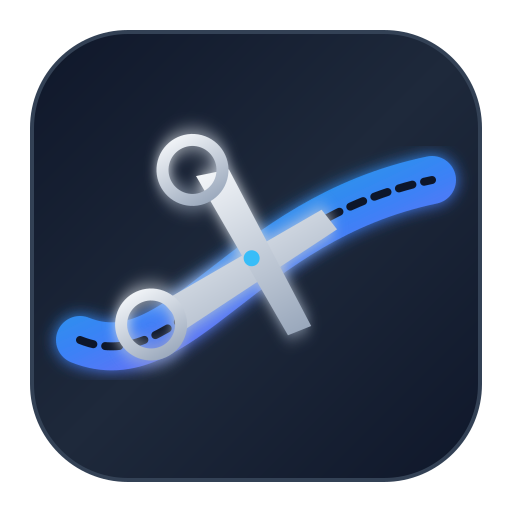

# ✂️ MPC Clipper

**MPC-HC / MPC-BE için Çoklu Video Kesme ve Donmasız/Senkronize Birleştirme Aracı**

MPC Clipper, MPC-HC veya MPC-BE medya oynatıcınızda izlediğiniz videolardan milisaniye hassasiyetinde canlı zaman aralıkları alarak, klipleri ses kayması veya görüntü donması olmadan kusursuz bir şekilde kesip tek bir dosyada birleştiren Python tabanlı modern bir araçtır.

---

## 🌟 Öne Çıkan Özellikler

- **Canlı MPC Entegrasyonu:** Tek tıkla MPC oynatıcınızdaki anlık zamanı (`00:01:23.456`) doğrudan programa çeker.
- **Kare Hassasiyetinde Yeniden Kodlama (Frame-Accurate):** Keyframe (GOP) hizalama sorunlarından kaynaklanan **ses kaymasını ("ses geriden/önden geliyor")** ve **görüntü donmasını ("donup atlama")** tamamen engeller.
- **Ses Senkronizasyonu:** Tüm kliplerin ses akışlarını standart AAC 48kHz Stereo biçimine dönüştürür ve zaman damgalarını otomatik yeniden senkronize eder (`aresample=async=1`).
- **Çoklu Kaynak Desteği:** Farklı video dosyalarından alınan parçaları otomatik en-boy oranı (Aspect Ratio) ve çözünürlük ölçekleme ile birleştirir.
- **Hızlı Kopya Modu (Stream Copy):** İstendiğinde videoları yeniden kodlamadan saniyeler içinde kesip birleştirir.
- **Esnek Kodlama Ayarları:** `ultrafast`, `veryfast`, `medium` hız seçenekleri ile Auto, 720p, 1080p ve 4K çözünürlük profilleri.

---

## 🛠️ Adım Adım Kurulum Rehberi

Programı sorunsuz bir şekilde kullanabilmeniz için aşağıdaki **3 temel bileşenin** bilgisayarınızda kurulu olması gerekmektedir:

### 1️⃣ Python Kurulumu (Gerekli)
- **İndirme Linki:** [Python Resmi İndirme Sayfası](https://www.python.org/downloads/)
- **Dikkat Edilmesi Gereken Nokta:** Kurulumu başlatırken ekranın en altındaki **"Add Python to PATH"** (Python'ı PATH'e ekle) seçeneğini **mutlaka işaretleyin**, ardından "Install Now" butonuna basın.

---

### 2️⃣ MPC-HC veya MPC-BE Medya Oynatıcısı
Programın videolarınızın zaman kodlarını canlı okuyabilmesi için MPC oynatıcısına ihtiyacı vardır:

- **MPC-HC (Recommended / Önerilen):** 
  👉 [MPC-HC GitHub Resmi İndirme Sayfası (clsid2)](https://github.com/clsid2/mpc-hc/releases)  
  *(En güncel `MPC-HC.x64.exe` kurucusunu indirip yükleyin)*
- **MPC-BE (Alternatif):** 
  👉 [MPC-BE SourceForge İndirme Sayfası](https://sourceforge.net/projects/mpcbe/)

#### ⚙️ MPC Web Arayüzünü Aktif Etme (ZORUNLU AYAR):
1. **MPC-HC** veya **MPC-BE** oynatıcısını açın.
2. Üst menüden **`Görünüm` ➔ `Seçenekler`** (veya klavyeden `O` tuşuna basın).
3. Sol menüden **`Oynatıcı` ➔ `Web Arayüzü`** (`Player` ➔ `Web Interface`) sekmesine gelin.
4. **"Dinleme Portu"** (`Listen on port`) kutucuğunu işaretleyin.
5. Port numarasının **`13579`** olduğundan emin olun.
6. **`Uygula`** ve **`Tamam`** butonuna basarak pencereyi kapatın.

---

### 3️⃣ FFmpeg Kurulumu
FFmpeg, videoların kesilmesi ve birleştirilmesini sağlayan arka plan motorudur.

- **İndirme Linki:** [FFmpeg Builds (GitHub BtbN Releases)](https://github.BtbN/FFmpeg-Builds/releases) veya [FFmpeg Official Site](https://ffmpeg.org/download.html)
- **En Pratik Kurulum Yöntemi:**
  1. İndirdiğiniz `.zip` veya `.7z` arşivini açın.
  2. Arşiv içindeki `bin` klasöründe yer alan **`ffmpeg.exe`** ve **`ffprobe.exe`** dosyalarını kopyalayın.
  3. Bu iki dosyayı **`mpc_clipper.pyw`** dosyasının bulunduğu proje klasörünün içine yapıştırın.

---

## 📖 Kullanım Rehberi

1. Videonuzu **MPC-HC / BE** ile açın ve oynatın.
2. Kesişe başlamak istediğiniz ana gelin, videoyu duraklatın veya oynatırken MPC Clipper üzerinde **`Set Start (from MPC)`** butonuna basın.
3. Kırpmanın biteceği ana gelin ve **`Set End (from MPC)`** butonuna basın.
4. **`Add Clip to List ⬇️`** butonuna basarak klip aralığını listenize ekleyin.
5. İstediğiniz kadar klip aralığı (aynı veya farklı videolardan) eklemeye devam edebilirsiniz.
6. **Render Ayarını Seçin:**
   - **Yeniden Kodla (Kesin Senkronize) [Önerilen]:** Ses kaymasını ve görüntü donmasını sıfıra indirir.
   - **Hızlı Kopya (Stream Copy):** Kodlama yapmadan saniyeler içinde keser (keyframe noktaları uyumlu videolar için).
7. **`Extract & Combine All ✂️`** butonuna basın, çıktının kaydedileceği klasörü ve dosya adını seçin.

---

## 🎨 İkonlar & Tasarım

- `favicon.svg` ve `icon.ico` / `icon.png` uygulama ikonları projeye dahil edilmiştir.
- Program çalıştırıldığında Windows Görev Çubuğunda (Taskbar) ve pencere başlığında özel uygulama ikonu otomatik görüntülenecektir.

---

## 📄 Lisans

Bu proje açık kaynaklıdır ve MIT lisansı altında sunulmaktadır.
